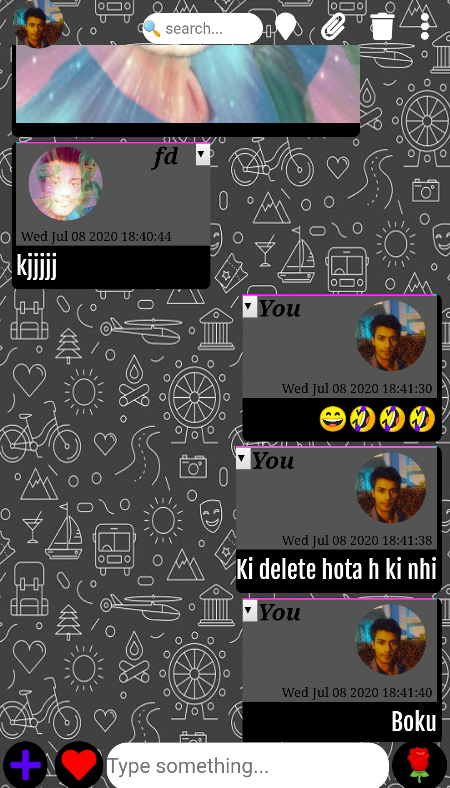
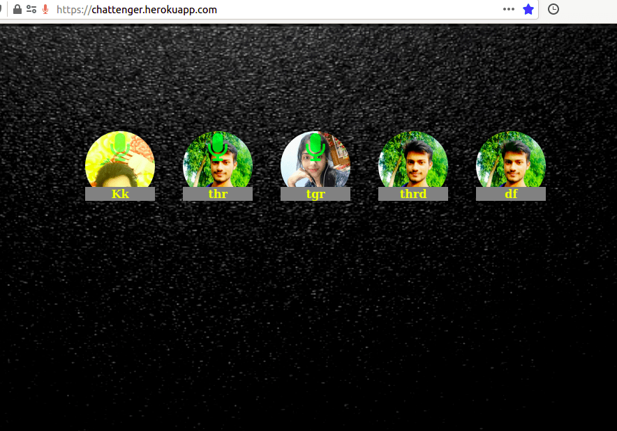

# chattenger

Chattenger is a node server based web application that enables you to establish real-time communication with your friends across the globe.

>Techniques and languages that were used

-HTML
-CSS
-JS
-Jquery
-AJAX
-Socket.io
-Nodejs
-Webrtc
-FileReader API
-Canvas filtering and image manipulation
-External API(like Gifskey api,tenor api,deezer api,imgur api)

>Features

## 1.Security

I have worked considerably on security factor,your password and admin key for your personal room is now securely stored after hasing with passwordHASH.

## 2.High quality video and voice calls

The quality of video call actually depends on the camera resolution of your device and internet connection(As applicable for all applications),you can make multiple video or voice chat with your room members.Screensharing option is also available on supported desktop browsers(chrome,firefox,opera or Edge).
kindly check <a href="https://caniuse.com/#search=webrtc">here</a> for your browser support before attempting to make a call.Recent versions of safari are now supporting webrtc,however still safari has problem in webrtc implementations on some of the devices.So if you are using this application with iphone or ipad,it's not sure whether your device will support webrtc or not.

## 3.Administration

A person who creates a group first is denoted as admin of that group,his/her login information is protected by the adminkey(that he/she provides during group creation),so ideally noone can login as admin unless he/she knows the admin key for that group.Besides,being an admin gives you access to change password for your group and remove any member in your group.

## 4.GIF,emogi ,stickers, music and wallpaper

These are just added to give wonderful experience to chatting.You can delete your sent messages any time.

## 5.File sharing and location sharing

File sharing is based on blob and filereader API.You can practically share a file of max-limit 100MB from a laptop(with 8GB ram).Since there is no intermediate data center involved in sharing file,therefore you need to have good internet connection for making successful sharing of larger file(since it is direct data transfer between client browsers through the server so some data may lost if you disconnect your net (or get disconnected because of poor connection) and consequently either file will not be received or will be received as incomplete(corrupt) file

## 6.Voice messaging

You can send voice messages.

## 7.Basic image filter

Image filter has also been added,you can apply or control filter properties like brightness,contrast,hue,saturation,opacity,blur,invert etc.You can also crop image before sharing.

There are much more things one can explore while using that i am not mentioning here.

## Update

Now profile pic can be added and will remain saved to your browser even if you refresh your browser.You have options to change fonts,text-color and text-size(font-size) as per your convenience.These all styles and fonts will also remain saved untill you update it.

> Credits

socket.io and webrtc are the most important things that made this project relevantly saucy.My heartful thanks to #webrtc and #socket.io developers for building such cools technology.

> Demo/pics

### chat demo::

### voice-chat demo::

To explore in reality,see description above and create a group to enjoy what i mean or <a href='https://chattenger.herokuapp.com'>Click</a> here.
### PS: Don't forget to give your feedback if you are going to use it.
